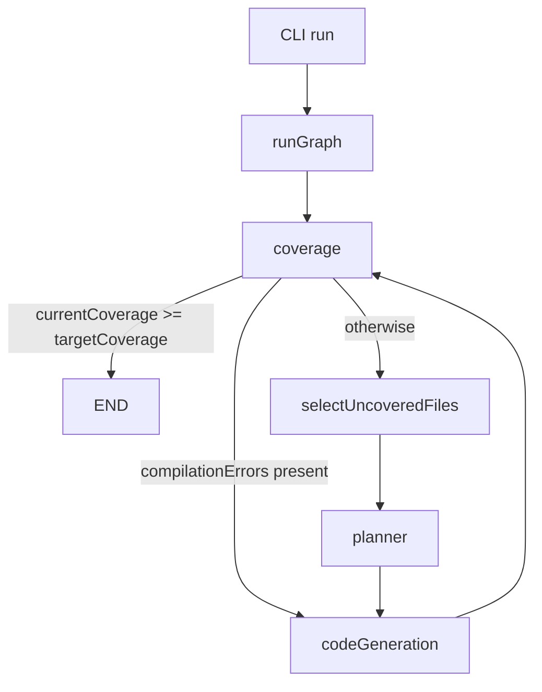

# unit-test-agent

CLI agent that generates Go unit tests and improves project coverage.

## Agent Architecture

The agent runs a graph-based loop that measures coverage, targets the highest-value files, plans tests, applies test changes, and re-measures until the target is reached.

I chose this design to keep deterministic paths deterministic and reserve LLM calls for decisions that actually need reasoning:
- Coverage measurement and file selection are deterministic.
- LLM calls are focused on planning and code generation only.
- Concurrency is controlled explicitly so planning and generation can scale without flooding model calls.
- Termination is bounded by `GRAPH_RECURSION_LIMIT` (graph loop) and an internal max-step guard in code generation.



### Node responsibilities

- `coverage`: runs `go test` with coverage, updates current coverage, and decides whether to stop, continue, or route to recovery when compilation/test errors exist.
- `selectUncoveredFiles`: parses coverage output and deterministically chooses the highest-impact uncovered files (bounded by `CONCURRENCY`) to avoid unnecessary LLM work.
- `planner`: generates high-level test plans for selected files (what cases to add, what behavior to validate) without directly editing code.
- `codeGeneration`: executes the plans by creating/updating test files via tools, then compiles and runs tests in a bounded loop before handing control back to `coverage`.

## Hardening Notes (Production-minded)

- For real-world usage, prefer a reasoning-capable model for `planner` and a lower-latency non-reasoning model for `codeGeneration` to balance quality and cost.
- Keep deterministic stages (`coverage`, `selectUncoveredFiles`) free of LLM dependencies so retries and failure analysis stay predictable.
- If adding Ollama support in Docker, run Ollama as a separate service/container and call it in API mode from the agent container.
- Alternatively, use a managed/cloud Ollama-compatible endpoint so the agent container only needs outbound API access.
- Enable LangSmith tracing in development/staging to inspect node-level execution, prompt/tool behavior, and failure paths during debugging.
  - `LANGSMITH_API_KEY`
  - `LANGSMITH_TRACING=true`
  - `LANGSMITH_PROJECT=<project-name>`
- Further hardening: parse `coverage.out` down to function-level spans and pass the exact under-tested functions/signatures to the LLM, so generation is guided by precise targets instead of relying on the model to infer what to test from file-level context alone.

## Local Setup

### 1) Install dependencies

```bash
npm install
```

### 2) Configure environment

```bash
cp .env.example .env
```

Edit `.env` and set at least:
- `SOURCE_FOLDER`
- `TARGET_COVERAGE`
- `TARGET_MODEL` (`openai` or `ollama`)
- `CONCURRENCY`
- `GRAPH_RECURSION_LIMIT`

Provider-specific variables:
- OpenAI: `OPENAI_API_KEY` (required), `OPENAI_MODEL` (optional)
- Ollama: `OLLAMA_MODEL` (optional)

### 3) Build the project

```bash
npm run build
```

### 4) Link CLI globally for local use

```bash
npm link
```

### 5) Run locally

Using linked CLI:

```bash
unit-test-agent run --src /absolute/path/to/go-repo --coverage 80 --model openai
```

Or using npm script:

```bash
npm run run -- --src /absolute/path/to/go-repo --coverage 80 --model openai
```

## Docker Guide (Practical Commands)

### Build image

```bash
docker build -t unit-test-agent .
```

### Run with explicit API key

```bash
docker run --rm \
  -v /absolute/path/to/go-repo:/workspace/target-repo \
  -e OPENAI_API_KEY="$OPENAI_API_KEY" \
  unit-test-agent run \
  --src /workspace/target-repo \
  --coverage 80 \
  --model openai
```

### Run with env file

```bash
docker run --rm \
  --env-file .env \
  -v /absolute/path/to/go-repo:/workspace/target-repo \
  unit-test-agent run \
  --src /workspace/target-repo \
  --coverage 80 \
  --model openai
```

### Helpful Docker notes

- Docker runtime support is intended for `--model openai`.
- Treat Ollama primarily as a local sanity/workflow testing option rather than the primary Docker path.
- Mount the target Go repo under `/workspace` and pass that mounted path to `--src`.
- The image already includes Go, Git, CA certificates, and the built CLI.
- Container entrypoint is the CLI, with default command `run`.
